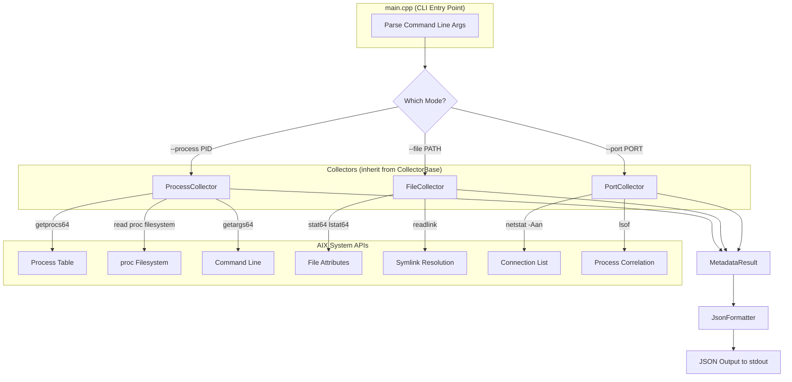

# AIX Metadata Collector PoC

A proof-of-concept metadata collector utility for AIX 7.2 that retrieves comprehensive metadata for processes, files, and network ports.

## Overview

This utility provides a single, consistent interface to query metadata from the AIX operating system. Given a **PID**, **file path**, or **port number**, it returns all relevant metadata that the OS knows about that object.

## Features

- **Process Metadata Collection**: Given a PID, retrieve process name, owner, state, memory usage, CPU stats, open file descriptors, command line, and more
- **File Metadata Collection**: Given a file path, retrieve type, size, permissions, ownership, timestamps, symlink info, and access rights
- **Port Metadata Collection**: Given a port number, retrieve all connections using that port, including protocol, addresses, state, and associated processes
- **JSON Output**: All output is in structured JSON format for easy parsing
- **Extensible Design**: Modular architecture makes it easy to add new collectors or metadata types

## Architecture



**Data Flow:**
1. User runs the CLI with a flag (`--process`, `--file`, or `--port`)
2. `main.cpp` parses arguments and instantiates the appropriate collector
3. The collector calls AIX-specific APIs to gather metadata
4. Results are returned as a `MetadataResult` struct
5. `JsonFormatter` converts the result to JSON and prints to stdout

## Project Structure

```
aix-metadata-collector/
├── README.md                    # This file
├── Makefile                     # Build system (supports xlC and g++)
├── include/                     # Header files
│   ├── types.h                  # Common data structures
│   ├── collector_base.h         # Abstract base class for collectors
│   ├── process_collector.h      # Process metadata collector
│   ├── file_collector.h         # File metadata collector
│   ├── port_collector.h         # Port/network metadata collector
│   └── json_formatter.h         # JSON output formatting
└── src/                         # Source files
    ├── main.cpp                 # CLI entry point
    ├── types.cpp                # Type implementations
    ├── process_collector.cpp    # Process collector implementation
    ├── file_collector.cpp       # File collector implementation
    ├── port_collector.cpp       # Port collector implementation
    └── json_formatter.cpp       # JSON formatter implementation
```

## Building

### Prerequisites

- AIX 7.2 (target platform)
- One of the following compilers:
  - IBM xlC (XL C++ compiler) - recommended
  - GCC (g++)

### Build Commands

```bash
# Build with auto-detected compiler (prefers xlC)
make

# Build with IBM xlC explicitly
make CXX=xlC

# Build with GCC
make CXX=g++

# Build with debug symbols
make debug

# Clean build artifacts
make clean

# Run tests
make test

# Install to /usr/local/bin (requires root)
sudo make install
```

### Development on macOS

The code compiles on macOS for development purposes, but AIX-specific features (like `getprocs64()`) are conditionally compiled. The full functionality requires building and running on AIX.

**To deploy to AIX:**
1. Create a ZIP archive of the project
2. Transfer to your AIX VM
3. Extract and run `make`

```bash
# On macOS - create archive
zip -r aix-metadata-collector.zip aix-metadata-collector/

# Transfer to AIX (replace with your VM details)
scp aix-metadata-collector.zip user@aix-vm:/tmp/

# On AIX - extract and build
cd /tmp
unzip aix-metadata-collector.zip
cd aix-metadata-collector
make
```

## Usage

```
aix-metadata-collector [OPTIONS]

Options:
  -p, --process <pid>     Collect metadata for a process by PID
  -f, --file <path>       Collect metadata for a file by path
  -P, --port <port>       Collect metadata for network connections on a port
  --protocol <proto>      Protocol filter for port queries (tcp, udp, or both)
                          Default: both
  --compact               Output compact JSON (no pretty printing)
  -h, --help              Show help message
  -v, --version           Show version information
```

### Examples

**Query a process by PID:**
```bash
$ ./bin/aix-metadata-collector --process 1234
{
  "success": true,
  "type": "process",
  "identifier": "1234",
  "attributes": {
    "pid": "1234",
    "ppid": "1",
    "comm": "sshd",
    "uid": "0",
    "user": "root",
    "state": "active",
    ...
  }
}
```

**Query a file:**
```bash
$ ./bin/aix-metadata-collector --file /etc/passwd
{
  "success": true,
  "type": "file",
  "identifier": "/etc/passwd",
  "attributes": {
    "type": "regular",
    "size": "1842",
    "mode_octal": "0644",
    "mode_symbolic": "rw-r--r--",
    "owner": "root",
    "group": "system",
    ...
  }
}
```

**Query a port:**
```bash
$ ./bin/aix-metadata-collector --port 22 --protocol tcp
{
  "success": true,
  "type": "port",
  "identifier": "22",
  "attributes": {
    "port": "22",
    "num_connections": "1",
    "connection_0_protocol": "tcp",
    "connection_0_local_address": "*",
    "connection_0_local_port": "22",
    "connection_0_state": "LISTEN",
    ...
  }
}
```

Example real execution:
```bash
-bash-4.4# ./bin/aix-metadata-collector --help
AIX Metadata Collector v1.0.0

Usage:
  aix-metadata-collector --process <pid>
  aix-metadata-collector --file <path>
  aix-metadata-collector --port <port> [--protocol tcp|udp|both]
  aix-metadata-collector --help
  aix-metadata-collector --version

Options:
  -p, --process <pid>     Collect metadata for a process by PID
  -f, --file <path>       Collect metadata for a file by path
  -P, --port <port>       Collect metadata for network connections on a port
  --protocol <proto>      Protocol filter for port queries (tcp, udp, or both)
                          Default: both
  --compact               Output compact JSON (no pretty printing)
  -h, --help              Show this help message
  -v, --version           Show version information

Examples:
  aix-metadata-collector --process 1234
  aix-metadata-collector --file /etc/passwd
  aix-metadata-collector --port 22 --protocol tcp
  aix-metadata-collector -p 1 --compact

Output:
  Results are output in JSON format to stdout.
  Errors are output to stderr.

Notes:
  - Some operations may require root privileges for full information.
  - Process and port queries may have limited data without elevated access.

-bash-4.4# ps -ef | grep ds_agent
    root 10813768        1   0   Dec 09      -  0:00 /opt/ds_agent/ds_am -g ../diag -v 5 -d /var/opt/ds_agent/am -P 4
    root 11206962 10813768   0   Dec 09      - 28:11 /opt/ds_agent/ds_am -g ../diag -v 5 -d /var/opt/ds_agent/am -P 4
    root 11272688 11600364   0   Dec 09      - 210:16 /opt/ds_agent/ds_agent -b -i -w /var/opt/ds_agent -e /opt/ds_agent/ext
    root 11600364  4129244   0   Dec 09      -  0:00 /opt/ds_agent/ds_agent -b -i -w /var/opt/ds_agent -e /opt/ds_agent/ext

-bash-4.4# ./bin/aix-metadata-collector -p 11272688
{
  "success": true,
  "type": "process",
  "identifier": "11272688",
  "attributes": {
    "pid": "11272688",
    "ppid": "11600364",
    "pgid": "11600364",
    "sid": "11600364",
    "comm": "ds_agent",
    "uid": "0",
    "user": "root",
    "gid": "0",
    "group": "system",
    "state": "active",
    "priority": "60",
    "nice": "20",
    "cpu": "0",
    "virtual_size_kb": "117648",
    "resident_size_kb": "117776",
    "start_time": "2025-12-09T15:18:40",
    "num_threads": "15",
    "flags": "0x40001",
    "tty": "major:0,minor:0",
    "exe_name": "ds_agent",
    "cwd": "/",
    "cmdline": "/opt/ds_agent/ds_agent -b -i -w /var/opt/ds_agent -e /opt/ds_agent/ext",
    "euid": "0",
    "egid": "0",
    "ruid": "0",
    "rgid": "0",
    "suid": "0",
    "sgid": "0",
    "effective_user": "root",
    "open_files": ["0", "1", "2", "4", "5", "6", "7", "8", "9", "10", "11", "12", "13", "14", "15", "16", "17", "18", "20", "21", "22", "23", "24", "25", "26", "28", "29", "30", "31", "32", "33", "34", "35", "37", "38"]
  }
}

-bash-4.4# ./bin/aix-metadata-collector --file /etc/passwd
{
  "success": true,
  "type": "file",
  "identifier": "/etc/passwd",
  "attributes": {
    "type": "regular",
    "size": "717",
    "device": "655364",
    "inode": "46",
    "nlink": "1",
    "mode_octal": "0644",
    "mode_symbolic": "rw-r--r--",
    "uid": "0",
    "owner": "root",
    "gid": "7",
    "group": "security",
    "access_time": "2026-01-21T15:12:00",
    "modify_time": "2025-06-10T13:03:23",
    "change_time": "2025-06-10T13:03:23",
    "atime_epoch": "1769026320",
    "mtime_epoch": "1749575003",
    "ctime_epoch": "1749575003",
    "block_size": "4096",
    "blocks": "8",
    "current_user_readable": "true",
    "current_user_writable": "true",
    "current_user_executable": "true"
  }
}

-bash-4.4# ./bin/aix-metadata-collector --port 22
{
  "success": true,
  "type": "port",
  "identifier": "22",
  "attributes": {
    "port": "22",
    "num_connections": "8",
    "connection_0_protocol": "tcp",
    "connection_0_local_address": "*",
    "connection_0_local_port": "22",
    "connection_0_remote_address": "*",
    "connection_0_remote_port": "*",
    "connection_0_state": "LISTEN",
    "connection_1_protocol": "tcp",
    "connection_1_local_address": "*",
    "connection_1_local_port": "22",
    "connection_1_remote_address": "*",
    "connection_1_remote_port": "*",
    "connection_1_state": "LISTEN",
    "connection_2_protocol": "tcp",
    "connection_2_local_address": "10.203.151.142",
    "connection_2_local_port": "22",
    "connection_2_remote_address": "10.165.32.112",
    "connection_2_remote_port": "50889",
    "connection_2_state": "ESTABLISHED",
    "connection_3_protocol": "tcp",
    "connection_3_local_address": "10.203.151.142",
    "connection_3_local_port": "22",
    "connection_3_remote_address": "10.165.32.112",
    "connection_3_remote_port": "50905",
    "connection_3_state": "ESTABLISHED",
    "connection_4_protocol": "tcp6",
    "connection_4_local_address": "*",
    "connection_4_local_port": "22",
    "connection_4_remote_address": "*",
    "connection_4_remote_port": "*",
    "connection_4_state": "LISTEN",
    "connection_5_protocol": "tcp6",
    "connection_5_local_address": "*",
    "connection_5_local_port": "22",
    "connection_5_remote_address": "*",
    "connection_5_remote_port": "*",
    "connection_5_state": "LISTEN",
    "connection_6_protocol": "tcp6",
    "connection_6_local_address": "10.203.151.142",
    "connection_6_local_port": "22",
    "connection_6_remote_address": "10.165.32.112",
    "connection_6_remote_port": "50889",
    "connection_6_state": "ESTABLISHED",
    "connection_7_protocol": "tcp6",
    "connection_7_local_address": "10.203.151.142",
    "connection_7_local_port": "22",
    "connection_7_remote_address": "10.165.32.112",
    "connection_7_remote_port": "50905",
    "connection_7_state": "ESTABLISHED"
  }
}

```

## Metadata Collected

### Process Metadata (--process)

| Attribute | Description |
|-----------|-------------|
| pid | Process ID |
| ppid | Parent process ID |
| pgid | Process group ID |
| sid | Session ID |
| comm | Command name (basename) |
| cmdline | Full command line with arguments |
| uid | User ID |
| user | Username |
| gid | Group ID |
| group | Group name |
| euid, egid | Effective user/group ID |
| ruid, rgid | Real user/group ID |
| state | Process state (active, idle, zombie, etc.) |
| priority | Scheduling priority |
| nice | Nice value |
| cpu | CPU usage |
| virtual_size_kb | Virtual memory size (KB) |
| resident_size_kb | Resident set size (KB) |
| start_time | Process start time |
| num_threads | Number of threads |
| exe_path | Executable path |
| cwd | Current working directory |
| open_files | List of open file descriptors |
| flags | Process flags (hex) |
| tty | Controlling terminal |

### File Metadata (--file)

| Attribute | Description |
|-----------|-------------|
| type | File type (regular, directory, symlink, etc.) |
| size | Size in bytes |
| device | Device ID |
| inode | Inode number |
| nlink | Number of hard links |
| mode_octal | Permissions in octal (e.g., 0644) |
| mode_symbolic | Permissions in symbolic (e.g., rw-r--r--) |
| uid | Owner user ID |
| owner | Owner username |
| gid | Owner group ID |
| group | Owner group name |
| access_time | Last access time |
| modify_time | Last modification time |
| change_time | Last status change time |
| atime_epoch, mtime_epoch, ctime_epoch | Times as Unix epoch |
| block_size | Block size |
| blocks | Number of blocks |
| is_symlink | Whether file is a symlink |
| symlink_target | Symlink target path |
| symlink_type | Symlink type (absolute/relative) |
| setuid, setgid, sticky | Special permission bits |
| current_user_readable | Whether current user can read |
| current_user_writable | Whether current user can write |
| current_user_executable | Whether current user can execute |

### Port Metadata (--port)

| Attribute | Description |
|-----------|-------------|
| port | Queried port number |
| num_connections | Number of connections found |
| connection_N_protocol | Protocol (tcp, udp, tcp6, udp6) |
| connection_N_local_address | Local IP address |
| connection_N_local_port | Local port |
| connection_N_remote_address | Remote IP address |
| connection_N_remote_port | Remote port |
| connection_N_state | Connection state (LISTEN, ESTABLISHED, etc.) |
| connection_N_pid | Process ID (if available) |
| connection_N_process | Process name (if available) |
| connection_N_user | User (if available) |

## AIX-Specific Implementation Details

### Process Information
- Uses `getprocs64()` to retrieve process table entries
- Reads from `/proc/[pid]/` for additional details:
  - `/proc/[pid]/cred` for credentials
  - `/proc/[pid]/cwd` for current directory
  - `/proc/[pid]/fd/` for open file descriptors
  - `/proc/[pid]/object/a.out` for executable path
- Uses `getargs()` to retrieve command line arguments

### File Information
- Uses `stat64()`/`lstat64()` for 64-bit file support
- Standard POSIX APIs for portability

### Port Information
- Parses `netstat -Aan` output for connection details
- Uses `lsof` (if available) to correlate sockets to processes
- Note: Process information for ports may require root privileges

## Security Considerations

- Some operations require elevated privileges:
  - Reading `/proc/[pid]/` for other users' processes
  - Getting process information for ports via lsof
- The utility only reads system information; it does not modify anything
- No external dependencies or network access required

## Future Enhancements

Potential areas for extension:
- Add kernel extension interface for deeper socket-to-process mapping
- Support for additional identifiers (e.g., file descriptor, inode)
- Integration with XES (Extended Event System)
- Caching layer for frequently-queried metadata
- Support for other UNIX platforms (Solaris, HP-UX)

## References

### IBM AIX 7.2 Official Documentation

**Relevant APIs:**
- Process APIs: `getprocs64()`, `/proc` filesystem documentation
- File APIs: `stat64`, `lstat64`, `stat.h` header documentation
- Network: netstat command usage and port-to-process correlation

**Header File Locations:**
- `/usr/include/procinfo.h` - process structures
- `/usr/include/sys/procfs.h` - credential structures
- `/usr/include/sys/stat.h` - file stat structures
- `/usr/include/sys/sysmacros.h` - device major/minor macros

**Code Examples:**
- IBM's official performance monitoring samples
- Community examples for `getprocs64()`


#### Process Information APIs
- [getprocs Subroutine](https://www.ibm.com/docs/en/aix/7.2?topic=g-getprocs-subroutine) - Official documentation for `procinfo.h`'s `getprocs64()` which retrieves process table entries
- [/proc File System](https://www.ibm.com/docs/ssw_aix_71/com.ibm.aix.files/proc.htm) - Documentation for the AIX procfs virtual filesystem
- [Purpose of the /proc File System](https://www.ibm.com/support/pages/purpose-proc-file-system) - Explains the /proc filesystem structure and usage
- [How to List Files Opened By a Process](https://www.ibm.com/support/pages/how-list-files-opened-process) - Using /proc and procfiles to list open files

#### File Information APIs
- [stat, fstat, lstat, stat64, fstat64, lstat64 Subroutine](https://www.ibm.com/docs/en/aix/7.2?topic=s-stat-fstat-lstat-statx-fstatx-statxat-fstatat-fullstat-ffullstat-stat64-fstat64-lstat64-stat64x-fstat64x-lstat64x-stat64xat-subroutine) - Official documentation for file stat functions
- [stat.h File](https://www.ibm.com/docs/ssw_aix_72/filesreference/stat.h.html) - Documentation for the stat64 structure and header file
- [File Times in AIX](https://www.ibm.com/support/pages/file-times-aix) - Understanding file timestamps on AIX

#### Network Information
- [Using the netstat command](https://www.ibm.com/docs/en/aix/7.2?topic=command-using-netstat) - AIX 7.2 netstat usage guide
- [netstat -a command](https://www.ibm.com/docs/en/aix/7.2?topic=command-netstat) - Detailed netstat options
- [Finding which program is using a port in AIX](https://www.ibm.com/support/pages/finding-which-program-using-port-aix) - Correlating sockets to processes

#### Header Files
- Process stats: `/usr/include/procinfo.h` - Contains `procentry64` structure and `getprocs64()` declaration
- Process credentials: `/usr/include/sys/procfs.h` - Contains `prcred` structure for `/proc/[pid]/cred`
- File stats: `/usr/include/sys/stat.h` - Contains `stat64` structure
- Device macros: `/usr/include/sys/sysmacros.h` - Contains `major()` and `minor()` macros

### Code Examples and Community Resources
- [AIX Performance Tools - Roll Your Own](https://www.ibm.com/support/pages/roll-your-own-aix-performance-monitor-code-samples) - IBM sample code for AIX performance monitoring
- [getprocs64 Example on GitHub](https://github.com/nigelargriffiths/AIX-Performance-Tools-Roll-Your-Own) - Community examples using getprocs64
- [Enumerating processes on AIX with getprocs64](https://gist.github.com/NattyNarwhal/fb012e9e79b073a746ce696126ee6fb1) - Code example for process enumeration
